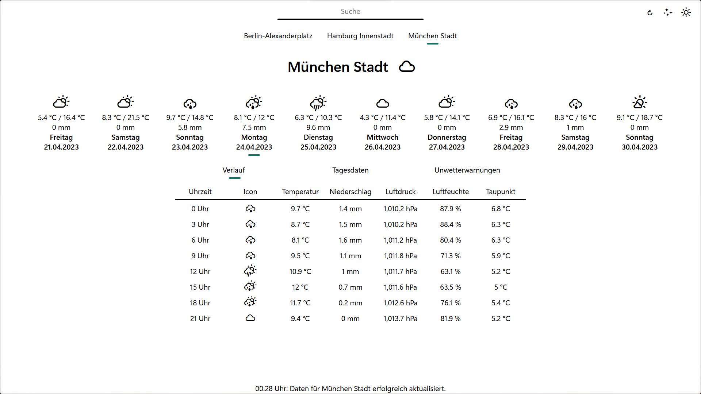

# Wetter

*Wetter* is a web application that can display recent measurements, severe weather warnings and the weather forecast for the upcoming ten days for arbitrary weather stations operated by the German Weather Service (*Deutscher Wetterdienst*/*DWD*).
Enjoy :)

## Usage

Run `app.js` with Node.js and open [localhost:8080](http://localhost:8080) in your browser.

In order to change the selectable stations while [#2](/../../issues/2) is unresolved, open `./public/js/main.js` and modify the `stations` array.
Both the `name` and the `id` parameters of a station can be looked up [here](https://www.dwd.de/DE/leistungen/met_verfahren_mosmix/mosmix_stationskatalog.cfg?view=nasPublication&nn=16102).

## Resources

### Data

The data displayed in this app is fetched fron the API of the *WarnWetter-App* by the *DWD*. Learn more about it at [here](https://dwd.api.bund.dev/) (unofficial).

### Icons

Learn more about the icons used in this project [here](https://erikflowers.github.io/weather-icons/).

## Screenshot

